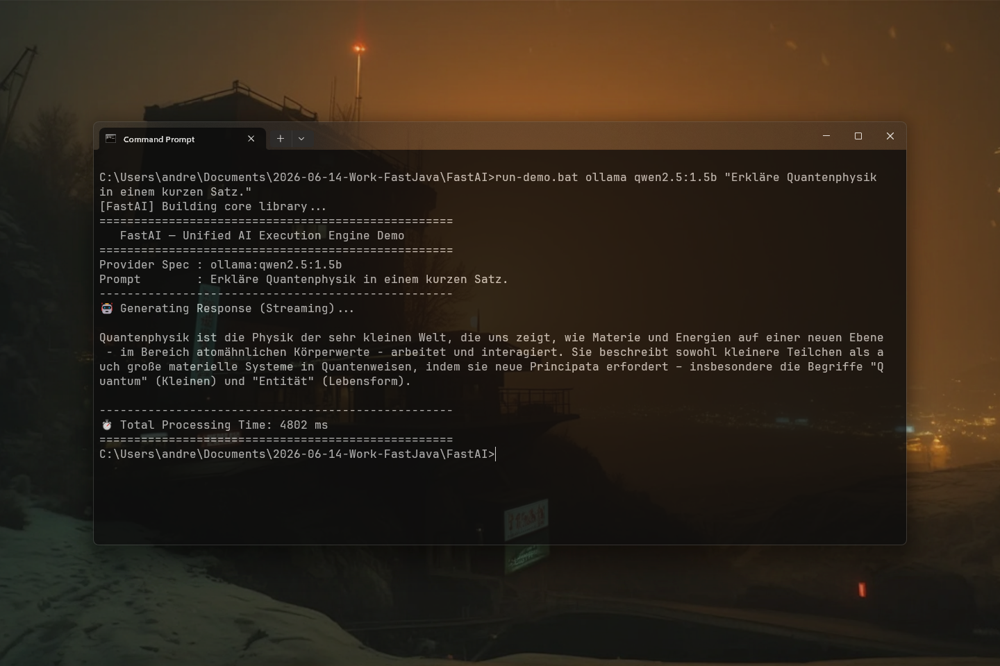

# FastAI 0.1.7 — Unified AI client for Java

[](https://github.com/andrestubbe/FastAI/releases/tag/0.1.7)
[](https://opensource.org/licenses/MIT)
[](https://www.java.com)
[]()
[](https://jitpack.io/#andrestubbe)

---

**💡 One interface for all Local, Gateway and Cloud AI models — No JSON, No HTTP, No Boilerplate.**

FastAI is a **minimalist, hyper-fast Java AI library** that unifies all major LLM providers (OmniRoute, Ollama, LM Studio, OpenAI, OpenRouter.ai, Claude, Mistral, DeepSeek) behind a single, elegant interface. Built for **Java developers** who hate JSON parsing, HTTP clients, and bloated frameworks.

If you need **a drop-in AI module**, **multi-provider interchangeability**, or **clean FastJava-style code**, FastAI is your solution.


---

[](https://youtu.be/kjfyZebSdj4)

---

## Quick Start

```java
import fastai.AI;
import fastai.FastAI;

public class QuickStartDemo {
    public static void main(String[] args) {
        // 1. Direct Local GGUF Engine with full Vulkan/Metal GPU Offloading (ON)
        AI gpuAI = FastAI.connect("llama:models/qwen2.5-coder-1.5b.gguf")
                         .withGpu(true)        // Full GPU acceleration ON (99 layers)
                         .withContextSize(2048);

        // 2. Direct Local GGUF Engine on CPU Only (GPU OFF)
        AI cpuAI = FastAI.connect("llama:models/qwen2.5-coder-1.5b.gguf")
                        .withGpu(false);       // Force CPU execution (0 GPU layers)

        // 3. Fluid streaming with full sampling control
        gpuAI.withSystemPrompt("You are an expert Java performance engineer.")
             .withTemperature(0.7f)
             .withTopP(0.9f)
             .withTopK(40)
             .withMaxTokens(256)
             .stream("Write a quicksort in Java:", token -> {
                 System.out.print(token);
                 System.out.flush();
             });

        // 4. Cloud provider instance with identical sampling & streaming interface
        AI cloudAI = FastAI.connect("openai:gpt-4o", System.getenv("OPENAI_API_KEY"));
        cloudAI.withTemperature(0.2f)
               .withMaxTokens(500)
               .stream("Summarize the latest 2026 tech trends:", token -> {
                   System.out.print(token);
                   System.out.flush();
               });
    }
}
```

---

## Table of Contents

- [Why FastAI?](#why-fastai)
- [Key Features](#key-features)
- [Installation](#installation)
- [API Reference](#api-reference)
- [Providers Supported](#providers-supported)
- [Performance](#performance)
- [Examples](#examples)
- [Project Structure](#project-structure)
- [Roadmap](#roadmap)
- [License](#license)

---

## Why FastAI?

Current AI libraries in Java (`LangChain4j`, `Spring AI`) are huge, framework-heavy, and come with dependency hell.
Direct SDKs lock you into one provider.

FastAI solves this by providing:

- **Zero JSON handling** — everything is native Java Strings and Files.
- **Provider Interchangeability** — switch between `ollama`, `openrouter`, and `openai` by changing one string.
- **Zero Dependencies** — pure Java 17+, no Jackson, no Spring.
- **True Unified Interface** — `AI` is all you need to know.

---

## Key Features

- **🌐 Local + Cloud Support** — Use local models, OpenRouter, or cloud giants with the exact same code.
- **⚡ In-Process Local GPU Engine** — Direct zero-IPC local LLM inference via **FastAIModel** with Vulkan (Intel/AMD/NVIDIA) and Metal (Apple Silicon) GPU offloading.
- **🔌 OpenRouter Unified Gateway** — Access 200+ models (Claude 3.5, DeepSeek R1, Llama 3.3, GPT-4o) using `openrouter:model/name`.
- **📎 Simple Attachments** — Pass a `java.io.File` and let FastAI handle the Base64/Multipart encoding.
- **🎭 System Prompts** — Native support for System vs User prompts.
- **⚡ Ultra-Lightweight** — Just drop the JAR into your project.
- **🌊 Streaming First** — Every provider supports unified streaming callbacks.

---


## Installation

### Option 1: Maven (Recommended)

Add the JitPack repository and the dependencies to your `pom.xml`:

```xml
<repositories>
    <repository>
        <id>jitpack.io</id>
        <url>https://jitpack.io</url>
    </repository>
</repositories>

<dependencies>
<!-- FastAI Library -->
<dependency>
    <groupId>com.github.andrestubbe</groupId>
    <artifactId>fastai</artifactId>
    <version>0.1.7</version>
</dependency>

<!-- FastJSON (Required Dependency) -->
<dependency>
    <groupId>com.github.andrestubbe</groupId>
    <artifactId>FastJSON</artifactId>
    <version>0.1.6</version>
</dependency>

<!-- FastCore (Required Native Loader) -->
<dependency>
    <groupId>com.github.andrestubbe</groupId>
    <artifactId>fastcore</artifactId>
    <version>0.1.6</version>
</dependency>

<!-- FastString (Required Dependency) -->
<dependency>
    <groupId>com.github.andrestubbe</groupId>
    <artifactId>FastString</artifactId>
    <version>0.1.6</version>
</dependency>

<!-- FastAIModel (Local In-Process GPU Engine) -->
<dependency>
    <groupId>com.github.andrestubbe.FastAIModel</groupId>
    <artifactId>fastaimodel-llama</artifactId>
    <version>0.1.3</version>
</dependency>
</dependencies>
```

### Option 2: Gradle (via JitPack)

```groovy
repositories {
    maven { url 'https://jitpack.io' }
}

dependencies {
    implementation 'com.github.andrestubbe:fastai:0.1.6'
    implementation 'com.github.andrestubbe:FastJSON:0.1.6'
    implementation 'com.github.andrestubbe:fastcore:0.1.6'
    implementation 'com.github.andrestubbe:FastString:0.1.6'
    implementation 'com.github.andrestubbe:FastBytes:0.1.6'
    implementation 'com.github.andrestubbe.FastAIModel:fastaimodel-llama:0.1.3'
}
```

### Option 3: Direct Download (No Build Tool)

Download the latest JARs directly to add them to your classpath:

1. 🚀 **[fastai-0.1.6.jar](https://github.com/andrestubbe/FastAI/releases/download/0.1.6/fastai-0.1.6.jar)** (Core Library)
2. 🤖 **[fastaimodel-llama-0.1.3.jar](https://github.com/andrestubbe/FastAIModel/releases/download/v0.1.3/fastaimodel-llama-0.1.3.jar)** (Local In-Process GPU Engine)
3. 📦 **[FastJSON-0.1.6.jar](https://github.com/andrestubbe/FastJSON/releases/download/0.1.6/FastJSON-0.1.6.jar)** (Required JSON Parser)
4. ⚙️ **[fastcore-0.1.6.jar](https://github.com/andrestubbe/FastCore/releases/download/0.1.6/fastcore-0.1.6.jar)** (Mandatory Native JNI Loader)
5. 📦 **[FastString-0.1.6.jar](https://github.com/andrestubbe/FastString/releases/download/0.1.6/FastString-0.1.6.jar)** (Required String Dependency)
6. 📦 **[FastBytes-0.1.6.jar](https://github.com/andrestubbe/FastBytes/releases/download/0.1.6/FastBytes-0.1.6.jar)** (Required Bytes Dependency)

> [!IMPORTANT]
> All JARs must be in your classpath for the native JNI calls to function correctly.

---

## API Reference

### Connect

```java
// Local Providers & In-Process GPU Engine
AI ai = FastAI.connect("llama:models/qwen2.5-coder-1.5b.gguf"); // Native Vulkan/Metal In-Process GPU Engine
AI ai = FastAI.connect("ollama:llama3.1");
AI ai = FastAI.connect("lmstudio:phi3");

// OpenRouter Unified Gateway (200+ models)
AI ai = FastAI.connect("openrouter:anthropic/claude-3.5-sonnet", "sk-or-...");
AI ai = FastAI.connect("openrouter:deepseek/deepseek-r1", "sk-or-...");

// Cloud Providers (requires API Key as second argument)
AI ai = FastAI.connect("openai:gpt-4o", "sk-...");
AI ai = FastAI.connect("claude:opus", "sk-ant-...");
AI ai = FastAI.connect("mistral:large", "key...");
AI ai = FastAI.connect("deepseek:chat", "key...");
```

### Generation & Prompting

```java
// Simple prompt
String answer = ai.ask("Hello!");

// System + User prompt
String answer = ai.ask("You are a math expert.", "Explain integrals.");

// Multimodal (Vision/Files)
String answer = ai.ask("What is in this image?", new File("diagram.png"));
```

### Streaming

```java
ai.stream("Write a poem",System.out::print);
```

---

## Providers Supported

| Provider         | Type  | Status     | Features                               |
|------------------|-------|------------|----------------------------------------|
| Ollama           | Local | ✔️ Native  | Chat, Streaming, List Models           |
| llama.cpp        | Local | ✔️ Native  | GGUF Local Inference (GPU missing)     |
| LM Studio        | Local | ✔️ Native  | Chat, Streaming via Local API          |
| Gemini           | Cloud | ✔️ Native  | Chat, Streaming, List Models           |
| OpenRouter       | Cloud | ✔️ Native  | Chat, Streaming, 200+ Models           |
| OpenAI           | Cloud | ✔️ Native  | Chat, Streaming                        |
| Anthropic Claude | Cloud | ✔️ Native  | Chat, Streaming                        |
| Mistral          | Cloud | ✔️ Native  | Chat, Streaming                        |
| DeepSeek         | Cloud | ✔️ Native  | Chat, Streaming                        |

---

## Performance

FastAI is **zero-dependency** and **zero-allocation** for the core connection layer:

| Metric              | LangChain4j | Spring AI | FastAI        |
|---------------------|-------------|-----------|---------------|
| **Dependencies**    | 15+         | 20+       | **0**         |
| **JAR Size**        | ~5MB        | ~10MB     | **~50KB**     |
| **Startup Time**    | 2-3s        | 5-10s     | **<100ms**    |
| **Memory Overhead** | High        | High      | **Minimal**   |
| **Learning Curve**  | Hours       | Hours     | **5 minutes** |

---

## Examples

Every feature has a standalone example in `examples/`:

```bash
cd examples/Demo
mvn compile exec:java    # Run demo
```

| Example          | Demonstrates                  |
|------------------|-------------------------------|
| `Demo`           | Local AI, Cloud AI, Streaming |

---

## API Quick Reference

| Method / Factory | Return Type | Description |
|------------------|-------------|-------------|
| `FastAI.connect(spec, args...)` | `AI` | Connects to a provider (e.g. `"gemini"`, `"ollama"`) with optional API key. |
| `ai.ask(prompt)` | `String` | Sends a simple user prompt to the model and returns the response. |
| `ai.ask(systemPrompt, userPrompt)` | `String` | Sends a prompt with a configured system instruction. |
| `ai.ask(prompt, file)` | `String` | Sends a prompt along with a file attachment (images/vision). |
| `ai.stream(prompt, handler)` | `void` | Streams tokens back dynamically as they are generated. |
| `ai.getModels()` | `List<String>` | Lists all available models from the provider. |

---

## Documentation

* **[COMPILE.md](COMPILE.md)**: Full compilation guide (MSVC C++17 build chain + JNI Setup).
* **[REFERENCE.md](docs/REFERENCE.md)**: Exhaustive catalog of SGR styles, OSC window parameters, and callback contracts.
* **[PHILOSOPHY.md](docs/PHILOSOPHY.md)**: Zero-allocation and low-overhead processing designs.
* **[ROADMAP.md](docs/ROADMAP.md)**: Planned milestone features and performance extensions.
* **[CHANGELOG.md](docs/CHANGELOG.md)**

---

## Platform Support

| Platform      | Status            |
|---------------|-------------------|
| Windows 10/11 | ✅ Fully Supported |
| Linux         | 🚧 Planned        |
| macOS         | 🚧 Planned        |

---

## License

MIT License  See [LICENSE](LICENSE) file for details.

---

## Related Projects

- [FastAIMemory](https://github.com/andrestubbe/FastAIMemory) - Unified conversation history and prompt formatters
- [FastAIModel](https://github.com/andrestubbe/FastAIModel) - Native local inference runtime (GGUF/ONNX)
- [FastCore](https://github.com/andrestubbe/FastCore) - Unified JNI loader and platform abstraction

---

**Part of the FastJava Ecosystem** — *Making the JVM faster. Small package. Maximum speed. Zero bloat. 🚀📋*

